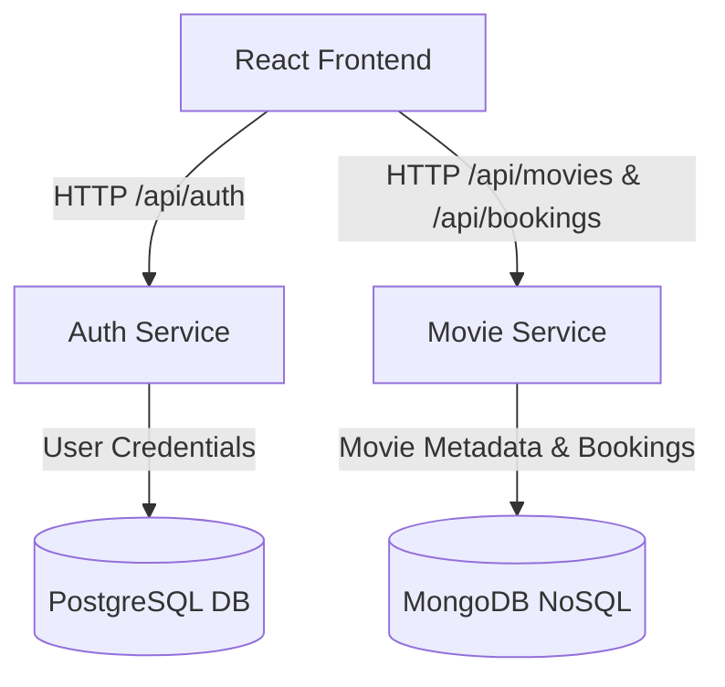

# CineVerse System Architecture Documentation

This document describes the high-level system architecture and technology stack selections for the **CineVerse Full-Stack Application** based on the current implementation.

---

## 🏛️ Architectural Overview

CineVerse is currently structured with a standalone frontend communicating directly with multiple backend microservices. The architecture is simplified for the current phase, handling distinct domains such as authentication and movie cataloging.

---

## 🛠️ Complete Tech Stack Selection & Justification

### 1. Frontend: React.js
*   **Purpose**: User Interface
*   **Justification**: Provides a component-based, reusable UI architecture, smooth routing (React Router), state management, and highly responsive page rendering via Virtual DOM. Uses Vite for fast builds and hot-module replacement.

### 2. Backend: Spring Boot
*   **Purpose**: Core API Business Logic
*   **Justification**: Enables fast development of production-ready services using Dependency Injection (IoC), integrated server dependencies, auto-configurations, and native support for Spring Security.

### 3. Databases: Polyglot Persistence
*   **PostgreSQL**:
    *   **Purpose**: Relational storage used by the **Auth Service** (Users, roles).
    *   **Justification**: Ensures strong consistency, constraint enforcement (unique emails), and full **ACID compliance** for crucial structural operations and user identity management.
*   **MongoDB**:
    *   **Purpose**: Document-based storage used by the **Movie Service** (Movies, shows, bookings).
    *   **Justification**: Dynamic document schemas make updating movie formats, genres, and metadata easy without performing expensive schema migration runs. Enables high read throughput for catalog browsing. Includes an embedded MongoDB option (`de.flapdoodle.embed`) for easy testing and local development.

### 4. Authentication: JWT (JSON Web Token)
*   **Purpose**: Stateless Authentication
*   **Justification**: Eliminates server-side session stores, allowing requests to scale across multiple instances statelessly by embedding role permissions securely in the signed token payload. Both services validate tokens to authorize requests.

---

## ⚙️ Monolith vs Microservices Trade-offs

| Characteristic | Monolith | Microservices | CineVerse Choice Justification |
| :--- | :--- | :--- | :--- |
| **Scaling** | Vertical (Scale entire app block) | Horizontal (Scale individual services) | **Microservices**: High movie-browsing volume requires scaling the catalog service independently of the auth service. |
| **Fault Isolation** | Low (A leak crash stops the app) | High (Catalog failure won't stop Auth) | **Microservices**: Critical auth/security services are isolated from media retrieval streams. |
| **Technology Choices** | Homogeneous stack | Heterogeneous stack per workload | **Microservices**: Enables matching PostgreSQL (relational auth) with MongoDB (unstructured movie listings). |
| **Management** | Simple (single package) | High (Requires network logs) | Accept complexity to mimic real-world production configurations, allowing future additions like Gateway or Messaging queues as needed. |

> [!NOTE]
> Previous iterations of this documentation mentioned API Gateway, Redis, RabbitMQ, and a Review Service. These components are not currently present in the codebase and have been removed from the architecture to reflect the actual implemented state.
